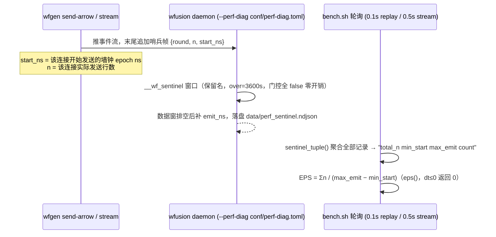

# NEXMark 性能测试方案（测试方法与度量口径）

> 本文回答「bench 结果每一列是怎么测出来的、口径是什么、什么情况下不可信」。
> 配套文档：`../README.md`（套件结构/用法）、`NEXMARK.md`（基准背景/数据/正确性标准）、
> `CAPABILITY_GAP_MATRIX.md`（查询能力判定）、`OSS_VVR_BASELINE.md`（白皮书基线）。
>
> 代码事实源：`../bench.sh`（驱动）、`../scripts/bench_lib.py`（度量工具库）、
> `wfgen` 的 `cmd_frames`/`cmd_stream`/`cmd_perf_diag`（哨兵帧生成）、
> wf-runtime `perf_diag.rs`（哨兵落盘）。改口径先改这里，再同步本文。

## 0. 口径一览

| 指标 | 主口径 | 备用口径 | 说明 |
|---|---|---|---|
| **EPS** | 哨兵四元组 `Σn/(max_emit−min_start)` | metrics-append / TIMEOUT 兑底 | 引擎侧精确墙钟窗，无轮询粒度误差 |
| **RSS_peak** | 采样峰值（100ms，全生命周期） | — | `ps rss`，macOS footprint 回退 |
| **CPU avg/max** | 哨兵活跃窗内样本（核占数，可 >100%） | 无哨兵时 [T0,T2] / 全样本 | 100ms cputime 差分 |
| **正确性** | `wfgen verify-nexmark` oracle 对拍 | — | 逐规则 EMIT 计数一致 + known-diff 清单 |

**读数第一条**：先看结果行的 `eps_mode=`——`sentinel` = 精确口径；`metrics-append` /
`⚠TIMEOUT` = 兑底值，只作量级参考。

## 1. EPS 统计口径（主：哨兵四元组）

### 1.1 链路



- **哨兵帧**（客户端，墙钟）：`wfgen` 推完数据追加
  `{round=连接号, n=该连接实际行数, start_ns=该连接开始发送时刻}`
  （`wfgen/src/cmd_frames/mod.rs`；stream 模式 `start_ns`=流开始时刻，`cmd_stream.rs`）。
  单连接 1 条（round=0）；多连接每连接 1 条。
- **引擎侧**：daemon 必须带 `--perf-diag conf/perf-diag.toml` 启动，才会注册保留窗口
  `__wf_sentinel`（schema `{round, n, start_ns}`，无时间列，不推进水位）。数据窗排空后
  引擎补 `emit_ns`（引擎墙钟），四元组经 alert 链落盘 `data/perf_sentinel.ndjson`
  （`wf-runtime/src/perf_diag.rs`）。
- **聚合**：`bench_lib.py sentinel_tuple()` 汇总全部 sentinel 记录 →
  `Σn / (max_emit − min_start)`（多连接取 min_start/max_emit 覆盖整批）；`eps()` =
  `int(n × 1e9 / dt)`，`dt` 非正返回 0（防除零）。

### 1.2 关键性质

| 性质 | 含义 |
|---|---|
| start/emit 都是**墙钟** | 同一台机器的 SystemTime 域，与事件时间无关 |
| EPS = 引擎**消化速率** | 数据窗从开始到排空的墙钟均值，是整轮平均不是峰值 |
| replay **不限速** | `rate=3M/s` 只作用于 stream 模式；replay 用预编码帧线速推，哨兵窗 ≈ 实际消化耗时（q2 10M/26M EPS ≈ 0.38s 即此窗） |
| 短跑可信 | 引擎写盘即完成信号，无 metrics 1s 轮询粒度误差（旧 append 口径 ±200ms） |
| 零性能影响 | 哨兵窗口初始门控全 false，不参与规则求值 |

### 1.3 目标 n（SENT_N）与哨兵 n 的关系

`SENT_N` 是 bench 期望引擎消化的目标行数（`bench.sh` `run_replay_one`）：

| 场景 | SENT_N |
|---|---|
| 单连接 | TOTAL_N |
| 多连接 raw（每连接推完整帧文件） | TOTAL_N × CONNECTIONS |
| 分片（shard-files/shard-keys，合计 = TOTAL_N） | TOTAL_N |

哨兵 `n` 是**客户端实际发送**行数（逐连接），`Σn` 天然等于 SENT_N；`appended` 列
（metrics `append_total` 求和）作旁证，正常等于 SENT_N。

### 1.4 兑底口径（哨兵缺失时）

等待循环：轮询 `sentinel_tuple`，出现即取哨兵口径并 `eps_mode=sentinel`。未出现时按序降级：

1. **metrics-append**：`engine_appended`（三输入流 `append_total` 求和）≥ TOTAL_N **且**
   `engine_acked_lag` = 0（**所有被消费窗口**追平——含 q13 中间管道窗口 bid_mod/auction_finals，
   只查三输入流会在下游消费滞后时提前 SIGTERM）→ `EPS = APP/(T2−T0)`（T0=客户端启动前、
   T2=追平时刻，bench 侧墙钟）。随后等 0.5s（replay）/1s（stream）再试读一次哨兵，读到即
   升级回哨兵口径（更精确）。
2. **TIMEOUT**：超过 `MAX_SEC`（replay：`TOTAL_N/100000 + 600`，按 100k/s 诚实下限 + 余量；
   stream：`TOTAL_N/RATE×3 + 60`）→ `EPS = APP/(T2−T0)`，结果行打 `⚠TIMEOUT(哨兵超时,...)`。

> 哨兵缺失最常见根因：daemon 未带 `--perf-diag`（哨兵帧 window miss 丢弃）、引擎卡死、
> 引擎持续能力 < 目标速率导致数据窗永不排空（stream 模式 backlog 堆积）。

## 2. RSS_peak 口径

- `rss-sampler`（`bench_lib.py`）每 100ms 读 `ps -o rss=,cputime=`；macOS ps 被拒时回退
  `footprint`；静默跳过失败样本。输出 `epoch_ns RSS_MB CPU_PCT` 三列。
- `RSS_peak` = **全部样本** RSS 最大值（MB，`data/rss_peak_bytes.txt` 兜底口径见 qradar）。
- 含义：整个运行生命周期的峰值驻留，包含启动/收尾段；快查询的短暂峰值可能落在采样网格
  之间被低估（保守方向）。

## 3. CPU avg/max 口径（2026-08-24 起）

- 瞬时 CPU = cputime 差分 / 墙钟差分 × 100（`ps %cpu` 是生命周期平均，不可用）；
  单位是**核占数**——多核并行可 >100%（如 298% ≈ 3 核忙）。
- 只统计**引擎活跃窗** `[sentinel start_ns − 0.5s, sentinel emit_ns + 0.5s]` 内的样本：
  剔除 daemon 启动、等流、收尾 `sleep 3` 的空闲稀释。无哨兵时间（兑底路径）退回 `[T0, T2]`；
  窗内无样本再回退全样本（宁粗勿空）。
- **基线前置**：采样器首 tick 只初始化基线，第一个差分要等第 2 次 `ps`；bench 在启动客户端前
  等采样器产出首个差分（`wait_sampler_baseline`）。否则亚秒级突发（q2/q8 ≈ 0.4s 活跃窗）会
  在首个差分前烧完 → 活跃窗内全是空闲样本，CPU 恒报 0%（两轮实测复现，确定性失败，与
  查询无关）。采样行每查询留档 `data/bench_<q>_<feed>_rss.txt` 供 0%/异常自查。
- 为什么必须按窗：1s 粗采样 + 全生命周期统计会把亚秒级突发（q2 26M EPS ≈ 0.4s）漏采/稀释成
  0% 假象（实测踩过）。短跑（<2s 活跃窗）读数仍只宜作量级参考。
- 历史 bug 已修：全 0 样本时 max 曾误报 `n/a`（awk `if(m)` 判 0 为假），现正确报 `0`。

## 4. 正确性验证口径（verify-nexmark）

- **oracle = 真实 WFL 规则引擎**逐事件求值（正确性参考，非性能引擎）：规则按 yield-bind
  依赖并查集分组，每组一线程独立吃**完整事件流**（非分片，墙钟 ≈ N/单组速率，慢是预期的）。
- 对拍：`wfgen verify-nexmark 10000000` → 归一化两侧为 `规则名 计数` 文本行（Myers 对齐），
  git-diff 式逐规则报告；退出码 0=一致 / 1=有差异。`bench.sh --verify` 串接同一对拍。
- **known-diff（对拍时已知，非回归）**：
  - stats 规则（StatsExecutor 列式批执行）oracle 未接入——跳过并标记「oracle 未覆盖」；
  - Q12 fixed+close 尾桶收口（fixed 收口靠预算/scan_timeouts 墙钟推进，oracle 事件时间到末尾
    即止——10M 实测 oracle=102,400 vs 引擎=282,514）；
  - 30M 对拍按 5% 容差，历史超差项见 `CAPABILITY_GAP_MATRIX.md`。
- 引擎侧取 oracle 覆盖的规则，单查询验证时其它查询残留 EMIT 是历史噪音，不计入。

## 5. 测量纪律（同 README「测量纪律」，此处为执行版）

1. **先看 `eps_mode=` 再读数字**：非 sentinel 的 EPS/CPU 只作量级参考。
2. **预热轮**：stash 重建后首跑系统性偏低（曾三次复现），`WARMUP=1` 剔除。
3. **A/B 必须不限速**：`RATE` 会把 EPS 封顶（限速 = 测供给不是引擎）。
4. **同时段交错对比**：bench 机 EPS 与 RSS_peak 呈双峰相位强相关（同配置差 ±8%），
   结论按 RSS 相位配对；单轮数字只作量级参考。
5. **引用 RSS 标注 `parse_buffer_bytes`**：默认 128MB 与 2GB 预算的 EPS/RSS 不可直接对等。
6. **Linux 探测**：核数走 `nproc`、loadavg 走 `/proc/loadavg`（`sysctl` 系 macOS 专属）；
   采样走 `ps`（权限被拒时 Linux 无 footprint 回退 → 样本为空，报 n/a）。

## 6. 复现命令

```sh
./bench.sh all replay 10m          # 22 查询全量吞吐 + RSS + CPU（哨兵 EPS 口径）
./bench.sh all replay 10m --verify # 同上 + 每查询 oracle 对拍（~40min 量级）
./bench.sh q2 replay 10m           # 单查询
./diag.sh q5 10m                   # 性能墙定位（六档墙梯 + 每段 CPU/RSS）
python3 scripts/extract_emitted.py data/metrics.ndjson  # 消费侧计数器
```
